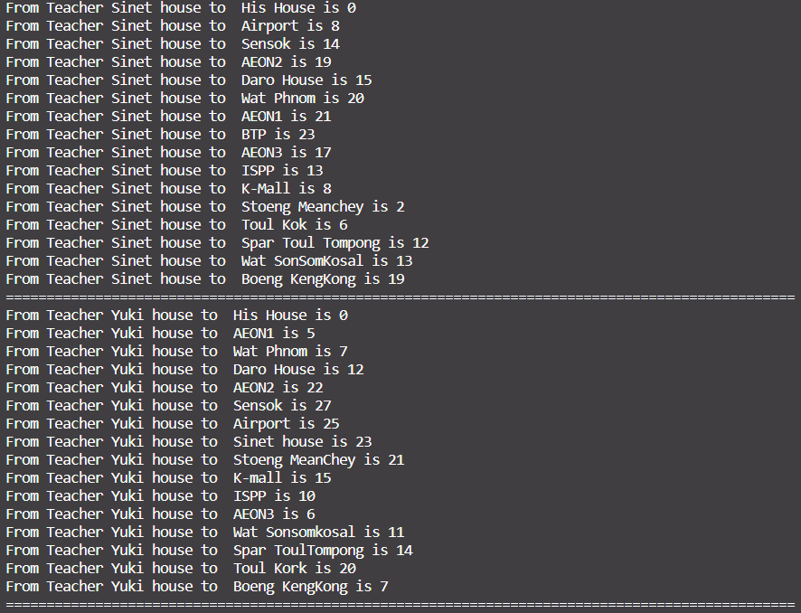
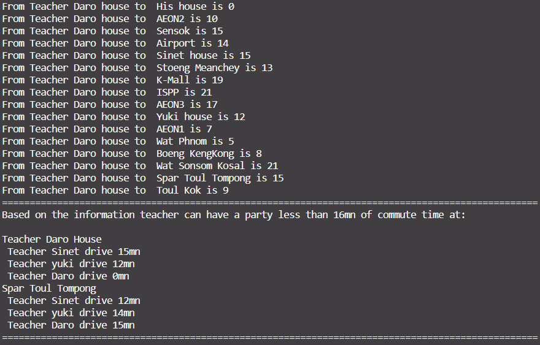

# Problem

t. Sinet lives in Chomka Doung, t Daro lives in Russey Keo and t Yuki
lives in B Tumpun. They want to meet and have @ party somewhere in
the city but they don’t want to travel throught the roads network more
than 15 min to the place. Where they can meet?

The travel’s time is indicated in the diagram.

## Problem diagram

## My Note

## Output

